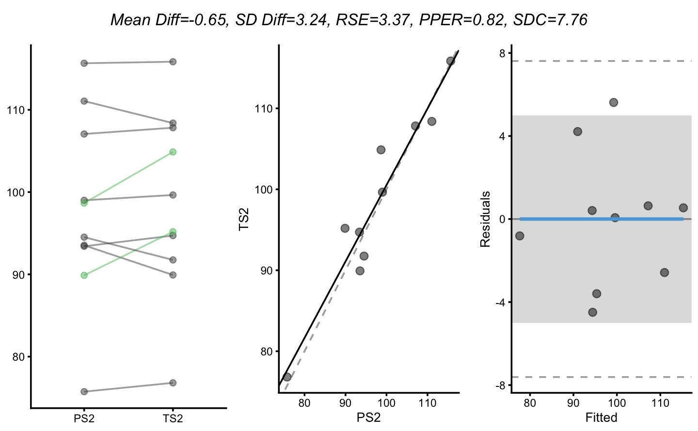
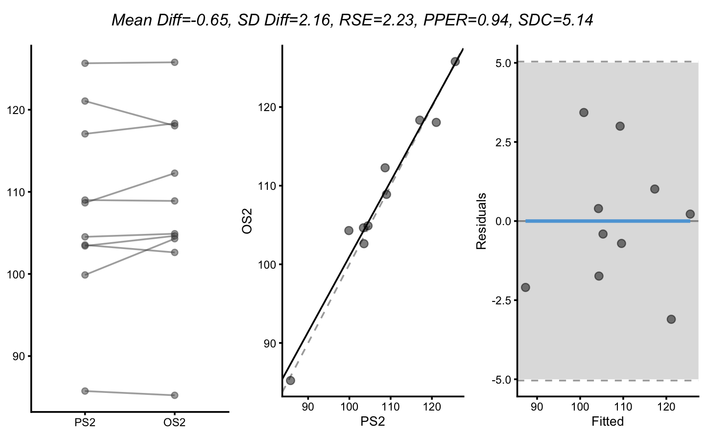
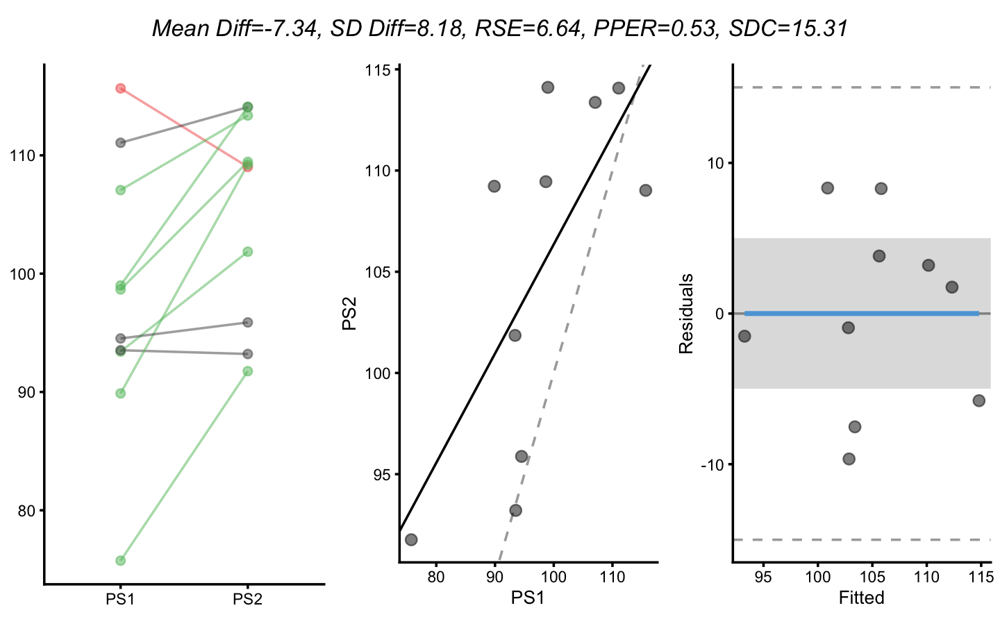

1RM prediction simulation
================
Mladen Jovanovic
9/15/2020

# Simulation \#1

True score 1RM stays the same across two measures, but observed score
varies due to biological variation and predicted (or practical in this
case) also varies due to the measurement error.

``` r
require(tidyverse)

# Install bmbstats from github
# install.packages("devtools")
# devtools::install_github("mladenjovanovic/bmbstats")
require(bmbstats)
require(cowplot)

biological_fixed <- 0
biological_proportional <- 1
biological_random <- 2

measurement_fixed <- 0
measurement_proportional <- 1
measurement_random <- 3

n_athletes <- 10

SESOI <- 5

random.seed <- 1667
boot_samples <- 2000
confidence <- 0.95
boot_type <- "bca"

# ==========================================
set.seed(random.seed)

data_1RM <- tibble(
  Athlete = paste0("Athlete", seq(1, n_athletes)),
  TS1 = rnorm(n_athletes, 100, 10),
  TS2 = TS1 + rnorm(n_athletes, 0, 0),
  TSdiff = TS2 - TS1,
  OS1 = biological_fixed + biological_proportional * TS1 + rnorm(n_athletes, 0, biological_random),
  OS2 = biological_fixed + biological_proportional * TS2 + rnorm(n_athletes, 0, biological_random),
  OSdiff = OS2 - OS1,
  PS1 = measurement_fixed + measurement_proportional * OS1 + rnorm(n_athletes, 0, measurement_random),
  PS2 = measurement_fixed + measurement_proportional * OS2 + rnorm(n_athletes, 0, measurement_random),
  PSdiff = PS2 - PS1
)

kable(data_1RM, digits = 2)
```

| Athlete   |    TS1 |    TS2 | TSdiff |    OS1 |    OS2 | OSdiff |    PS1 |    PS2 | PSdiff |
| :-------- | -----: | -----: | -----: | -----: | -----: | -----: | -----: | -----: | -----: |
| Athlete1  | 115.85 | 115.85 |      0 | 112.17 | 115.78 |   3.61 | 107.96 | 115.66 |   7.70 |
| Athlete2  |  94.71 |  94.71 |      0 |  94.87 |  94.64 | \-0.23 |  97.62 |  93.41 | \-4.21 |
| Athlete3  | 108.39 | 108.39 |      0 | 106.56 | 108.05 |   1.49 | 104.38 | 111.06 |   6.68 |
| Athlete4  |  99.65 |  99.65 |      0 | 102.69 |  98.89 | \-3.80 | 102.35 |  99.00 | \-3.35 |
| Athlete5  |  89.92 |  89.92 |      0 |  89.55 |  92.62 |   3.07 |  85.39 |  93.53 |   8.14 |
| Athlete6  |  95.18 |  95.18 |      0 |  97.55 |  94.29 | \-3.25 |  97.87 |  89.88 | \-7.99 |
| Athlete7  |  91.76 |  91.76 |      0 |  90.11 |  94.90 |   4.79 |  87.78 |  94.52 |   6.75 |
| Athlete8  | 107.83 | 107.83 |      0 | 106.18 | 108.33 |   2.15 | 104.18 | 107.06 |   2.89 |
| Athlete9  |  76.81 |  76.81 |      0 |  78.93 |  75.22 | \-3.71 |  80.06 |  75.74 | \-4.32 |
| Athlete10 | 104.88 | 104.88 |      0 | 105.32 | 102.27 | \-3.04 | 100.86 |  98.66 | \-2.20 |

``` r
# datatable(data_1RM, rownames = FALSE, filter = "top") %>%
#  formatRound(columns = 2:ncol(data_1RM), digits = 2)
```

## Analysis and plotting functions

``` r
my_estimators <- function(data,
                          trial1,
                          trial2,
                          SESOI_lower = 0,
                          SESOI_upper = 0,
                          na.rm = FALSE) {
  predicted <- data[[trial1]]
  observed <- data[[trial2]]

  SESOI_range <- SESOI_upper - SESOI_lower

  mean_diff <- mean(predicted - observed, na.rm = na.rm)
  sd_diff <- sd(predicted - observed, na.rm = na.rm)

  model <- lm(observed ~ predicted)
  rse <- summary(model)$sigma

  # Proportion of practically equivalent residuals
  pper <- PPER(
    sigma = rse,
    SESOI_lower = SESOI_lower,
    SESOI_upper = SESOI_upper,
    df = length(observed) - 2
  )

  sdc <- rse * stats::qt(1 - ((1 - 0.95) / 2), df = length(observed) - 2)

  c(
    `Mean Diff` = mean_diff,
    `SD Diff` = sd_diff,
    RSE = rse,
    PPER = pper,
    SDC = sdc
  )
}

# ===========================
analyse_func <- function(data, predictor, outcome) {
  data <- data.frame(
    predictor = data[[predictor]],
    outcome = data[[outcome]]
  )

  estimators <- my_estimators(
    data = na.omit(data),
    trial1 = "predictor",
    trial2 = "outcome",
    SESOI_lower = -SESOI,
    SESOI_upper = SESOI
  )

  estimators_text <- paste0(names(estimators), "=", round(estimators, 2), collapse = ", ")

  # Bland Altman
  gg <- plot_grid(
    ggdraw() + draw_label(estimators_text,
      fontface = "italic", size = 10
    ),
    plot_grid(

      plot_pair_changes(
        group_a = data$predictor,
        group_b = data$outcome,
        group_a_label = predictor,
        group_b_label = outcome,
        SESOI_lower = -SESOI,
        SESOI_upper = SESOI
      ),

      plot_pair_lm(
        predictor = data$predictor,
        outcome = data$outcome,
        predictor_label = predictor,
        outcome_label = outcome,
        SESOI_lower = -SESOI,
        SESOI_upper = SESOI,
        na.rm = TRUE,
        control = plot_control(panel_labels = c(NULL, NULL))
      ),
      nrow = 1,
      rel_widths = c(1, 2)
    ),
    ncol = 1,
    rel_heights = c(0.1, 1)
  )

  print(gg)

  boot_estimators <- reliability_analysis(
    data,
    trial1 = "predictor",
    trial2 = "outcome",
    SESOI_lower = function(...) -SESOI,
    SESOI_upper = function(...) SESOI,
    estimator_function = my_estimators,
    control = model_control(
      boot_type = boot_type,
      boot_samples = boot_samples,
      seed = random.seed,
      iter = FALSE
    ),
    na.rm = TRUE
  )
  print(boot_estimators)
  return(boot_estimators)
}
```

## Plotting and analysis

### Repeatability

``` r
TS1_TS2 <- analyse_func(data_1RM, "TS1", "TS2")
#> [1] "All values of t are equal to  1 \n Cannot calculate confidence intervals"
#> Bootstrap with 2000 resamples and 95% bca confidence intervals.
#> 
#>  estimator        value        lower        upper
#>  Mean Diff 0.000000e+00           NA           NA
#>    SD Diff 0.000000e+00           NA           NA
#>        RSE 2.999657e-15 1.505980e-15 9.640419e-15
#>       PPER 1.000000e+00           NA           NA
#>        SDC 6.917222e-15 3.472796e-15 2.223085e-14
```


``` r
OS1_OS2 <- analyse_func(data_1RM, "OS1", "OS2")
#> Bootstrap with 2000 resamples and 95% bca confidence intervals.
#> 
#>  estimator      value      lower     upper
#>  Mean Diff -0.1072232 -2.0588388  1.804896
#>    SD Diff  3.3372401  2.7188618  4.035380
#>        RSE  3.4914455  2.9390140  4.371637
#>       PPER  0.8099872  0.7141996  0.872783
#>        SDC  8.0512878  6.7773784 10.081012
```


``` r
PS1_PS2 <- analyse_func(data_1RM, "PS1", "PS2")
#> Bootstrap with 2000 resamples and 95% bca confidence intervals.
#> 
#>  estimator      value      lower      upper
#>  Mean Diff -1.0087098 -4.5209413  2.4437751
#>    SD Diff  6.0563534  5.0348371  7.5823568
#>        RSE  6.4069467  5.3719317  8.2275206
#>       PPER  0.5423795  0.4397732  0.6231564
#>        SDC 14.7744456 12.3876966 18.9726965
```


### Validity (Prediction)

#### Observed vs True

``` r
OS1_TS1 <- analyse_func(data_1RM, "OS1", "TS1")
#> Bootstrap with 2000 resamples and 95% bca confidence intervals.
#> 
#>  estimator      value      lower     upper
#>  Mean Diff -0.1043656 -1.3861669 1.0845323
#>    SD Diff  2.1559806  1.5678445 2.9633183
#>        RSE  2.0388283  1.5455981 2.8575890
#>       PPER  0.9602118  0.8817181 0.9879474
#>        SDC  4.7015466  3.5641556 6.5896120
```


``` r
OS2_TS2 <- analyse_func(data_1RM, "OS2", "TS2")
#> Bootstrap with 2000 resamples and 95% bca confidence intervals.
#> 
#>  estimator       value      lower    upper
#>  Mean Diff 0.002857644 -0.9203233 1.238481
#>    SD Diff 1.770575874  1.1057375 2.528214
#>        RSE 1.877413735  1.3627953 2.668398
#>       PPER 0.971338820  0.9021637 0.994054
#>        SDC 4.329323836  3.1426116 6.153336
```


``` r
OSdiff_TSdiff <- analyse_func(data_1RM, "OSdiff", "TSdiff")
#> [1] "All values of t are equal to  1 \n Cannot calculate confidence intervals"
#> Bootstrap with 2000 resamples and 95% bca confidence intervals.
#> 
#>  estimator     value     lower    upper
#>  Mean Diff 0.1072232 -1.804896 2.058839
#>    SD Diff 3.3372401  2.718862 4.035380
#>        RSE 0.0000000        NA       NA
#>       PPER 1.0000000        NA       NA
#>        SDC 0.0000000        NA       NA
```


#### Predicted vs True

``` r
PS1_TS1 <- analyse_func(data_1RM, "PS1", "TS1")
#> Bootstrap with 2000 resamples and 95% bca confidence intervals.
#> 
#>  estimator      value      lower      upper
#>  Mean Diff -1.6538919 -4.0356039  0.7952805
#>    SD Diff  4.0858862  3.2969316  5.1922919
#>        RSE  4.1137105  3.4327996  5.0780111
#>       PPER  0.7411557  0.6462981  0.8166370
#>        SDC  9.4862333  7.9160500 11.7099146
```


``` r
PS2_TS2 <- analyse_func(data_1RM, "PS2", "TS2")
#> Bootstrap with 2000 resamples and 95% bca confidence intervals.
#> 
#>  estimator      value      lower      upper
#>  Mean Diff -0.6451821 -2.8109446  1.0206343
#>    SD Diff  3.2371815  2.0843364  4.4865283
#>        RSE  3.3653194  2.3923335  4.9259868
#>       PPER  0.8243479  0.6598998  0.9296012
#>        SDC  7.7604404  5.5167311 11.3593459
```



``` r
PSdiff_TSdiff <- analyse_func(data_1RM, "PSdiff", "TSdiff")
#> [1] "All values of t are equal to  1 \n Cannot calculate confidence intervals"
#> Bootstrap with 2000 resamples and 95% bca confidence intervals.
#> 
#>  estimator    value     lower    upper
#>  Mean Diff 1.008710 -2.443775 4.520941
#>    SD Diff 6.056353  5.034837 7.582357
#>        RSE 0.000000        NA       NA
#>       PPER 1.000000        NA       NA
#>        SDC 0.000000        NA       NA
```


#### Predicted vs Observed

``` r
PS1_OS1 <- analyse_func(data_1RM, "PS1", "OS1")
#> Bootstrap with 2000 resamples and 95% bca confidence intervals.
#> 
#>  estimator      value      lower      upper
#>  Mean Diff -1.5495263 -2.9144616 -0.1206552
#>    SD Diff  2.4524812  1.7516373  3.2788672
#>        RSE  2.5359484  1.8724295  3.7272502
#>       PPER  0.9158712  0.7834002  0.9710836
#>        SDC  5.8479075  4.3178301  8.5950545
```


``` r
PS2_OS2 <- analyse_func(data_1RM, "PS2", "OS2")
#> Bootstrap with 2000 resamples and 95% bca confidence intervals.
#> 
#>  estimator      value      lower     upper
#>  Mean Diff -0.6480398 -2.0351213 0.5087004
#>    SD Diff  2.1552666  1.3430488 3.2152946
#>        RSE  2.2281263  1.7428895 3.0878137
#>       PPER  0.9449227  0.8559505 0.9792954
#>        SDC  5.1380685  4.0191104 7.1205112
```


``` r
PSdiff_OSdiff <- analyse_func(data_1RM, "PSdiff", "OSdiff")
#> Bootstrap with 2000 resamples and 95% bca confidence intervals.
#> 
#>  estimator     value     lower     upper
#>  Mean Diff 0.9014866 -1.103533 2.8606881
#>    SD Diff 3.4186045  2.326112 4.6481639
#>        RSE 1.5874863  1.336729 1.9861474
#>       PPER 0.9863940  0.964048 0.9942495
#>        SDC 3.6607500  3.082503 4.5800642
```


Save estimators in data frame:

``` r
experiment1 <- rbind(
  data.frame(experiment = "1", comparison = "TS1 vs. TS2", TS1_TS2$estimators),
  data.frame(experiment = "1", comparison = "OS1 vs. OS2", OS1_OS2$estimators),
  data.frame(experiment = "1", comparison = "PS1 vs. PS2", PS1_PS2$estimators),
  data.frame(experiment = "1", comparison = "OS1 vs. TS1", OS1_TS1$estimators),
  data.frame(experiment = "1", comparison = "OS2 vs. TS2", OS2_TS2$estimators),
  data.frame(experiment = "1", comparison = "OSdiff vs. TSdiff", OSdiff_TSdiff$estimators),
  data.frame(experiment = "1", comparison = "PS1 vs. TS1", PS1_TS1$estimators),
  data.frame(experiment = "1", comparison = "PS2 vs. TS2", PS2_TS2$estimators),
  data.frame(experiment = "1", comparison = "PSdiff vs. TSdiff", PSdiff_TSdiff$estimators),
  data.frame(experiment = "1", comparison = "PS1 vs. OS1", PS1_OS1$estimators),
  data.frame(experiment = "1", comparison = "PS2 vs. OS2", PS2_OS2$estimators),
  data.frame(experiment = "1", comparison = "PSdiff vs. OSdiff", PSdiff_OSdiff$estimators)
)

experiment1 <- experiment1 %>%
  mutate(
    comparison = factor(comparison),
    estimator = factor(estimator)
  )

kable(experiment1, digits = 2)
```

| experiment | comparison        | estimator |  value |  lower |  upper |
| :--------- | :---------------- | :-------- | -----: | -----: | -----: |
| 1          | TS1 vs. TS2       | Mean Diff |   0.00 |     NA |     NA |
| 1          | TS1 vs. TS2       | SD Diff   |   0.00 |     NA |     NA |
| 1          | TS1 vs. TS2       | RSE       |   0.00 |   0.00 |   0.00 |
| 1          | TS1 vs. TS2       | PPER      |   1.00 |     NA |     NA |
| 1          | TS1 vs. TS2       | SDC       |   0.00 |   0.00 |   0.00 |
| 1          | OS1 vs. OS2       | Mean Diff | \-0.11 | \-2.06 |   1.80 |
| 1          | OS1 vs. OS2       | SD Diff   |   3.34 |   2.72 |   4.04 |
| 1          | OS1 vs. OS2       | RSE       |   3.49 |   2.94 |   4.37 |
| 1          | OS1 vs. OS2       | PPER      |   0.81 |   0.71 |   0.87 |
| 1          | OS1 vs. OS2       | SDC       |   8.05 |   6.78 |  10.08 |
| 1          | PS1 vs. PS2       | Mean Diff | \-1.01 | \-4.52 |   2.44 |
| 1          | PS1 vs. PS2       | SD Diff   |   6.06 |   5.03 |   7.58 |
| 1          | PS1 vs. PS2       | RSE       |   6.41 |   5.37 |   8.23 |
| 1          | PS1 vs. PS2       | PPER      |   0.54 |   0.44 |   0.62 |
| 1          | PS1 vs. PS2       | SDC       |  14.77 |  12.39 |  18.97 |
| 1          | OS1 vs. TS1       | Mean Diff | \-0.10 | \-1.39 |   1.08 |
| 1          | OS1 vs. TS1       | SD Diff   |   2.16 |   1.57 |   2.96 |
| 1          | OS1 vs. TS1       | RSE       |   2.04 |   1.55 |   2.86 |
| 1          | OS1 vs. TS1       | PPER      |   0.96 |   0.88 |   0.99 |
| 1          | OS1 vs. TS1       | SDC       |   4.70 |   3.56 |   6.59 |
| 1          | OS2 vs. TS2       | Mean Diff |   0.00 | \-0.92 |   1.24 |
| 1          | OS2 vs. TS2       | SD Diff   |   1.77 |   1.11 |   2.53 |
| 1          | OS2 vs. TS2       | RSE       |   1.88 |   1.36 |   2.67 |
| 1          | OS2 vs. TS2       | PPER      |   0.97 |   0.90 |   0.99 |
| 1          | OS2 vs. TS2       | SDC       |   4.33 |   3.14 |   6.15 |
| 1          | OSdiff vs. TSdiff | Mean Diff |   0.11 | \-1.80 |   2.06 |
| 1          | OSdiff vs. TSdiff | SD Diff   |   3.34 |   2.72 |   4.04 |
| 1          | OSdiff vs. TSdiff | RSE       |   0.00 |     NA |     NA |
| 1          | OSdiff vs. TSdiff | PPER      |   1.00 |     NA |     NA |
| 1          | OSdiff vs. TSdiff | SDC       |   0.00 |     NA |     NA |
| 1          | PS1 vs. TS1       | Mean Diff | \-1.65 | \-4.04 |   0.80 |
| 1          | PS1 vs. TS1       | SD Diff   |   4.09 |   3.30 |   5.19 |
| 1          | PS1 vs. TS1       | RSE       |   4.11 |   3.43 |   5.08 |
| 1          | PS1 vs. TS1       | PPER      |   0.74 |   0.65 |   0.82 |
| 1          | PS1 vs. TS1       | SDC       |   9.49 |   7.92 |  11.71 |
| 1          | PS2 vs. TS2       | Mean Diff | \-0.65 | \-2.81 |   1.02 |
| 1          | PS2 vs. TS2       | SD Diff   |   3.24 |   2.08 |   4.49 |
| 1          | PS2 vs. TS2       | RSE       |   3.37 |   2.39 |   4.93 |
| 1          | PS2 vs. TS2       | PPER      |   0.82 |   0.66 |   0.93 |
| 1          | PS2 vs. TS2       | SDC       |   7.76 |   5.52 |  11.36 |
| 1          | PSdiff vs. TSdiff | Mean Diff |   1.01 | \-2.44 |   4.52 |
| 1          | PSdiff vs. TSdiff | SD Diff   |   6.06 |   5.03 |   7.58 |
| 1          | PSdiff vs. TSdiff | RSE       |   0.00 |     NA |     NA |
| 1          | PSdiff vs. TSdiff | PPER      |   1.00 |     NA |     NA |
| 1          | PSdiff vs. TSdiff | SDC       |   0.00 |     NA |     NA |
| 1          | PS1 vs. OS1       | Mean Diff | \-1.55 | \-2.91 | \-0.12 |
| 1          | PS1 vs. OS1       | SD Diff   |   2.45 |   1.75 |   3.28 |
| 1          | PS1 vs. OS1       | RSE       |   2.54 |   1.87 |   3.73 |
| 1          | PS1 vs. OS1       | PPER      |   0.92 |   0.78 |   0.97 |
| 1          | PS1 vs. OS1       | SDC       |   5.85 |   4.32 |   8.60 |
| 1          | PS2 vs. OS2       | Mean Diff | \-0.65 | \-2.04 |   0.51 |
| 1          | PS2 vs. OS2       | SD Diff   |   2.16 |   1.34 |   3.22 |
| 1          | PS2 vs. OS2       | RSE       |   2.23 |   1.74 |   3.09 |
| 1          | PS2 vs. OS2       | PPER      |   0.94 |   0.86 |   0.98 |
| 1          | PS2 vs. OS2       | SDC       |   5.14 |   4.02 |   7.12 |
| 1          | PSdiff vs. OSdiff | Mean Diff |   0.90 | \-1.10 |   2.86 |
| 1          | PSdiff vs. OSdiff | SD Diff   |   3.42 |   2.33 |   4.65 |
| 1          | PSdiff vs. OSdiff | RSE       |   1.59 |   1.34 |   1.99 |
| 1          | PSdiff vs. OSdiff | PPER      |   0.99 |   0.96 |   0.99 |
| 1          | PSdiff vs. OSdiff | SDC       |   3.66 |   3.08 |   4.58 |

``` r
# datatable(experiment1, rownames = FALSE, filter = "top") %>%
#  formatRound(columns = 4:ncol(experiment1), digits = 2)
```

# Simulation \#2

In this simulation there is true change in 1RM, where everyone improves
for 10kg. Let’s see how that plays out

``` r
set.seed(random.seed)
data_1RM <- tibble(
  Athlete = paste0("Athlete", seq(1, n_athletes)),
  TS1 = rnorm(n_athletes, 100, 10),
  TS2 = TS1 + rnorm(n_athletes, 10, 0),
  TSdiff = TS2 - TS1,
  OS1 = biological_fixed + biological_proportional * TS1 + rnorm(n_athletes, 0, biological_random),
  OS2 = biological_fixed + biological_proportional * TS2 + rnorm(n_athletes, 0, biological_random),
  OSdiff = OS2 - OS1,
  PS1 = measurement_fixed + measurement_proportional * OS1 + rnorm(n_athletes, 0, measurement_random),
  PS2 = measurement_fixed + measurement_proportional * OS2 + rnorm(n_athletes, 0, measurement_random),
  PSdiff = PS2 - PS1
)

kable(data_1RM, digits = 2)
```

| Athlete   |    TS1 |    TS2 | TSdiff |    OS1 |    OS2 | OSdiff |    PS1 |    PS2 | PSdiff |
| :-------- | -----: | -----: | -----: | -----: | -----: | -----: | -----: | -----: | -----: |
| Athlete1  | 115.85 | 125.85 |     10 | 112.17 | 125.78 |  13.61 | 107.96 | 125.66 |  17.70 |
| Athlete2  |  94.71 | 104.71 |     10 |  94.87 | 104.64 |   9.77 |  97.62 | 103.41 |   5.79 |
| Athlete3  | 108.39 | 118.39 |     10 | 106.56 | 118.05 |  11.49 | 104.38 | 121.06 |  16.68 |
| Athlete4  |  99.65 | 109.65 |     10 | 102.69 | 108.89 |   6.20 | 102.35 | 109.00 |   6.65 |
| Athlete5  |  89.92 |  99.92 |     10 |  89.55 | 102.62 |  13.07 |  85.39 | 103.53 |  18.14 |
| Athlete6  |  95.18 | 105.18 |     10 |  97.55 | 104.29 |   6.75 |  97.87 |  99.88 |   2.01 |
| Athlete7  |  91.76 | 101.76 |     10 |  90.11 | 104.90 |  14.79 |  87.78 | 104.52 |  16.75 |
| Athlete8  | 107.83 | 117.83 |     10 | 106.18 | 118.33 |  12.15 | 104.18 | 117.06 |  12.89 |
| Athlete9  |  76.81 |  86.81 |     10 |  78.93 |  85.22 |   6.29 |  80.06 |  85.74 |   5.68 |
| Athlete10 | 104.88 | 114.88 |     10 | 105.32 | 112.27 |   6.96 | 100.86 | 108.66 |   7.80 |

``` r
# datatable(data_1RM, rownames = FALSE, filter = "top") %>%
#  formatRound(columns = 2:ncol(data_1RM), digits = 2)
```

## Plotting and analysis

### Repeatability

``` r
TS1_TS2 <- analyse_func(data_1RM, "TS1", "TS2")
#> [1] "All values of t are equal to  1 \n Cannot calculate confidence intervals"
#> Bootstrap with 2000 resamples and 95% bca confidence intervals.
#> 
#>  estimator         value lower        upper
#>  Mean Diff -1.000000e+01    NA           NA
#>    SD Diff  0.000000e+00    NA           NA
#>        RSE  2.999657e-15     0 1.497259e-14
#>       PPER  1.000000e+00    NA           NA
#>        SDC  6.917222e-15     0 3.452684e-14
```


``` r
OS1_OS2 <- analyse_func(data_1RM, "OS1", "OS2")
#> Bootstrap with 2000 resamples and 95% bca confidence intervals.
#> 
#>  estimator       value       lower     upper
#>  Mean Diff -10.1072232 -12.0588388 -8.195104
#>    SD Diff   3.3372401   2.7188618  4.035380
#>        RSE   3.4914455   2.9390140  4.371637
#>       PPER   0.8099872   0.7141996  0.872783
#>        SDC   8.0512878   6.7773784 10.081012
```


``` r
PS1_PS2 <- analyse_func(data_1RM, "PS1", "PS2")
#> Bootstrap with 2000 resamples and 95% bca confidence intervals.
#> 
#>  estimator       value       lower      upper
#>  Mean Diff -11.0087098 -14.5209413 -7.5562249
#>    SD Diff   6.0563534   5.0348371  7.5823568
#>        RSE   6.4069467   5.3719317  8.2275206
#>       PPER   0.5423795   0.4397732  0.6231564
#>        SDC  14.7744456  12.3876966 18.9726965
```


### Validity (Prediction)

#### Observed vs True

``` r
OS1_TS1 <- analyse_func(data_1RM, "OS1", "TS1")
#> Bootstrap with 2000 resamples and 95% bca confidence intervals.
#> 
#>  estimator      value      lower     upper
#>  Mean Diff -0.1043656 -1.3861669 1.0845323
#>    SD Diff  2.1559806  1.5678445 2.9633183
#>        RSE  2.0388283  1.5455981 2.8575890
#>       PPER  0.9602118  0.8817181 0.9879474
#>        SDC  4.7015466  3.5641556 6.5896120
```


``` r
OS2_TS2 <- analyse_func(data_1RM, "OS2", "TS2")
#> Bootstrap with 2000 resamples and 95% bca confidence intervals.
#> 
#>  estimator       value      lower    upper
#>  Mean Diff 0.002857644 -0.9203233 1.238481
#>    SD Diff 1.770575874  1.1057375 2.528214
#>        RSE 1.877413735  1.3627953 2.668398
#>       PPER 0.971338820  0.9021637 0.994054
#>        SDC 4.329323836  3.1426116 6.153336
```


``` r
OSdiff_TSdiff <- analyse_func(data_1RM, "OSdiff", "TSdiff")
#> [1] "All values of t are equal to  1 \n Cannot calculate confidence intervals"
#> Bootstrap with 2000 resamples and 95% bca confidence intervals.
#> 
#>  estimator        value         lower        upper
#>  Mean Diff 1.072232e-01 -1.804896e+00 2.058839e+00
#>    SD Diff 3.337240e+00  2.718862e+00 4.035380e+00
#>        RSE 1.751643e-15  1.043625e-15 1.861764e-15
#>       PPER 1.000000e+00            NA           NA
#>        SDC 4.039296e-15  2.406604e-15 4.293234e-15
```


#### Predicted vs True

``` r
PS1_TS1 <- analyse_func(data_1RM, "PS1", "TS1")
#> Bootstrap with 2000 resamples and 95% bca confidence intervals.
#> 
#>  estimator      value      lower      upper
#>  Mean Diff -1.6538919 -4.0356039  0.7952805
#>    SD Diff  4.0858862  3.2969316  5.1922919
#>        RSE  4.1137105  3.4327996  5.0780111
#>       PPER  0.7411557  0.6462981  0.8166370
#>        SDC  9.4862333  7.9160500 11.7099146
```


``` r
PS2_TS2 <- analyse_func(data_1RM, "PS2", "TS2")
#> Bootstrap with 2000 resamples and 95% bca confidence intervals.
#> 
#>  estimator      value      lower      upper
#>  Mean Diff -0.6451821 -2.8109446  1.0206343
#>    SD Diff  3.2371815  2.0843364  4.4865283
#>        RSE  3.3653194  2.3923335  4.9259868
#>       PPER  0.8243479  0.6598998  0.9296012
#>        SDC  7.7604404  5.5167311 11.3593459
```


``` r
PSdiff_TSdiff <- analyse_func(data_1RM, "PSdiff", "TSdiff")
#> [1] "All values of t are equal to  1 \n Cannot calculate confidence intervals"
#> Bootstrap with 2000 resamples and 95% bca confidence intervals.
#> 
#>  estimator        value         lower        upper
#>  Mean Diff 1.008710e+00 -2.443775e+00 4.520941e+00
#>    SD Diff 6.056353e+00  5.034837e+00 7.582357e+00
#>        RSE 1.736265e-15  8.848893e-16 1.845685e-15
#>       PPER 1.000000e+00            NA           NA
#>        SDC 4.003835e-15  2.040558e-15 4.256157e-15
```


#### Predicted vs Observed

``` r
PS1_OS1 <- analyse_func(data_1RM, "PS1", "OS1")
#> Bootstrap with 2000 resamples and 95% bca confidence intervals.
#> 
#>  estimator      value      lower      upper
#>  Mean Diff -1.5495263 -2.9144616 -0.1206552
#>    SD Diff  2.4524812  1.7516373  3.2788672
#>        RSE  2.5359484  1.8724295  3.7272502
#>       PPER  0.9158712  0.7834002  0.9710836
#>        SDC  5.8479075  4.3178301  8.5950545
```


``` r
PS2_OS2 <- analyse_func(data_1RM, "PS2", "OS2")
#> Bootstrap with 2000 resamples and 95% bca confidence intervals.
#> 
#>  estimator      value      lower     upper
#>  Mean Diff -0.6480398 -2.0351213 0.5087004
#>    SD Diff  2.1552666  1.3430488 3.2152946
#>        RSE  2.2281263  1.7428895 3.0878137
#>       PPER  0.9449227  0.8559505 0.9792954
#>        SDC  5.1380685  4.0191104 7.1205112
```



``` r
PSdiff_OSdiff <- analyse_func(data_1RM, "PSdiff", "OSdiff")
#> Bootstrap with 2000 resamples and 95% bca confidence intervals.
#> 
#>  estimator     value     lower     upper
#>  Mean Diff 0.9014866 -1.103533 2.8606881
#>    SD Diff 3.4186045  2.326112 4.6481639
#>        RSE 1.5874863  1.336729 1.9861474
#>       PPER 0.9863940  0.964048 0.9942495
#>        SDC 3.6607500  3.082503 4.5800642
```


Save estimators in data frame:

``` r
experiment2 <- rbind(
  data.frame(experiment = "2", comparison = "TS1 vs. TS2", TS1_TS2$estimators),
  data.frame(experiment = "2", comparison = "OS1 vs. OS2", OS1_OS2$estimators),
  data.frame(experiment = "2", comparison = "PS1 vs. PS2", PS1_PS2$estimators),
  data.frame(experiment = "2", comparison = "OS1 vs. TS1", OS1_TS1$estimators),
  data.frame(experiment = "2", comparison = "OS2 vs. TS2", OS2_TS2$estimators),
  data.frame(experiment = "2", comparison = "OSdiff vs. TSdiff", OSdiff_TSdiff$estimators),
  data.frame(experiment = "2", comparison = "PS1 vs. TS1", PS1_TS1$estimators),
  data.frame(experiment = "2", comparison = "PS2 vs. TS2", PS2_TS2$estimators),
  data.frame(experiment = "2", comparison = "PSdiff vs. TSdiff", PSdiff_TSdiff$estimators),
  data.frame(experiment = "2", comparison = "PS1 vs. OS1", PS1_OS1$estimators),
  data.frame(experiment = "2", comparison = "PS2 vs. OS2", PS2_OS2$estimators),
  data.frame(experiment = "2", comparison = "PSdiff vs. OSdiff", PSdiff_OSdiff$estimators)
)

experiment2 <- experiment2 %>%
  mutate(
    comparison = factor(comparison),
    estimator = factor(estimator)
  )

kable(experiment2, digits = 2)
```

| experiment | comparison        | estimator |   value |   lower |  upper |
| :--------- | :---------------- | :-------- | ------: | ------: | -----: |
| 2          | TS1 vs. TS2       | Mean Diff | \-10.00 |      NA |     NA |
| 2          | TS1 vs. TS2       | SD Diff   |    0.00 |      NA |     NA |
| 2          | TS1 vs. TS2       | RSE       |    0.00 |    0.00 |   0.00 |
| 2          | TS1 vs. TS2       | PPER      |    1.00 |      NA |     NA |
| 2          | TS1 vs. TS2       | SDC       |    0.00 |    0.00 |   0.00 |
| 2          | OS1 vs. OS2       | Mean Diff | \-10.11 | \-12.06 | \-8.20 |
| 2          | OS1 vs. OS2       | SD Diff   |    3.34 |    2.72 |   4.04 |
| 2          | OS1 vs. OS2       | RSE       |    3.49 |    2.94 |   4.37 |
| 2          | OS1 vs. OS2       | PPER      |    0.81 |    0.71 |   0.87 |
| 2          | OS1 vs. OS2       | SDC       |    8.05 |    6.78 |  10.08 |
| 2          | PS1 vs. PS2       | Mean Diff | \-11.01 | \-14.52 | \-7.56 |
| 2          | PS1 vs. PS2       | SD Diff   |    6.06 |    5.03 |   7.58 |
| 2          | PS1 vs. PS2       | RSE       |    6.41 |    5.37 |   8.23 |
| 2          | PS1 vs. PS2       | PPER      |    0.54 |    0.44 |   0.62 |
| 2          | PS1 vs. PS2       | SDC       |   14.77 |   12.39 |  18.97 |
| 2          | OS1 vs. TS1       | Mean Diff |  \-0.10 |  \-1.39 |   1.08 |
| 2          | OS1 vs. TS1       | SD Diff   |    2.16 |    1.57 |   2.96 |
| 2          | OS1 vs. TS1       | RSE       |    2.04 |    1.55 |   2.86 |
| 2          | OS1 vs. TS1       | PPER      |    0.96 |    0.88 |   0.99 |
| 2          | OS1 vs. TS1       | SDC       |    4.70 |    3.56 |   6.59 |
| 2          | OS2 vs. TS2       | Mean Diff |    0.00 |  \-0.92 |   1.24 |
| 2          | OS2 vs. TS2       | SD Diff   |    1.77 |    1.11 |   2.53 |
| 2          | OS2 vs. TS2       | RSE       |    1.88 |    1.36 |   2.67 |
| 2          | OS2 vs. TS2       | PPER      |    0.97 |    0.90 |   0.99 |
| 2          | OS2 vs. TS2       | SDC       |    4.33 |    3.14 |   6.15 |
| 2          | OSdiff vs. TSdiff | Mean Diff |    0.11 |  \-1.80 |   2.06 |
| 2          | OSdiff vs. TSdiff | SD Diff   |    3.34 |    2.72 |   4.04 |
| 2          | OSdiff vs. TSdiff | RSE       |    0.00 |    0.00 |   0.00 |
| 2          | OSdiff vs. TSdiff | PPER      |    1.00 |      NA |     NA |
| 2          | OSdiff vs. TSdiff | SDC       |    0.00 |    0.00 |   0.00 |
| 2          | PS1 vs. TS1       | Mean Diff |  \-1.65 |  \-4.04 |   0.80 |
| 2          | PS1 vs. TS1       | SD Diff   |    4.09 |    3.30 |   5.19 |
| 2          | PS1 vs. TS1       | RSE       |    4.11 |    3.43 |   5.08 |
| 2          | PS1 vs. TS1       | PPER      |    0.74 |    0.65 |   0.82 |
| 2          | PS1 vs. TS1       | SDC       |    9.49 |    7.92 |  11.71 |
| 2          | PS2 vs. TS2       | Mean Diff |  \-0.65 |  \-2.81 |   1.02 |
| 2          | PS2 vs. TS2       | SD Diff   |    3.24 |    2.08 |   4.49 |
| 2          | PS2 vs. TS2       | RSE       |    3.37 |    2.39 |   4.93 |
| 2          | PS2 vs. TS2       | PPER      |    0.82 |    0.66 |   0.93 |
| 2          | PS2 vs. TS2       | SDC       |    7.76 |    5.52 |  11.36 |
| 2          | PSdiff vs. TSdiff | Mean Diff |    1.01 |  \-2.44 |   4.52 |
| 2          | PSdiff vs. TSdiff | SD Diff   |    6.06 |    5.03 |   7.58 |
| 2          | PSdiff vs. TSdiff | RSE       |    0.00 |    0.00 |   0.00 |
| 2          | PSdiff vs. TSdiff | PPER      |    1.00 |      NA |     NA |
| 2          | PSdiff vs. TSdiff | SDC       |    0.00 |    0.00 |   0.00 |
| 2          | PS1 vs. OS1       | Mean Diff |  \-1.55 |  \-2.91 | \-0.12 |
| 2          | PS1 vs. OS1       | SD Diff   |    2.45 |    1.75 |   3.28 |
| 2          | PS1 vs. OS1       | RSE       |    2.54 |    1.87 |   3.73 |
| 2          | PS1 vs. OS1       | PPER      |    0.92 |    0.78 |   0.97 |
| 2          | PS1 vs. OS1       | SDC       |    5.85 |    4.32 |   8.60 |
| 2          | PS2 vs. OS2       | Mean Diff |  \-0.65 |  \-2.04 |   0.51 |
| 2          | PS2 vs. OS2       | SD Diff   |    2.16 |    1.34 |   3.22 |
| 2          | PS2 vs. OS2       | RSE       |    2.23 |    1.74 |   3.09 |
| 2          | PS2 vs. OS2       | PPER      |    0.94 |    0.86 |   0.98 |
| 2          | PS2 vs. OS2       | SDC       |    5.14 |    4.02 |   7.12 |
| 2          | PSdiff vs. OSdiff | Mean Diff |    0.90 |  \-1.10 |   2.86 |
| 2          | PSdiff vs. OSdiff | SD Diff   |    3.42 |    2.33 |   4.65 |
| 2          | PSdiff vs. OSdiff | RSE       |    1.59 |    1.34 |   1.99 |
| 2          | PSdiff vs. OSdiff | PPER      |    0.99 |    0.96 |   0.99 |
| 2          | PSdiff vs. OSdiff | SDC       |    3.66 |    3.08 |   4.58 |

``` r
# datatable(experiment2, rownames = FALSE, filter = "top") %>%
#  formatRound(columns = 4:ncol(experiment2), digits = 2)
```

# Simulation \#3

In this simulation there is true change in 1RM, where everyone improves,
but this time variable (mean = 10, sd = 5). Let’s see how that plays out

``` r
set.seed(random.seed)

data_1RM <- tibble(
  Athlete = paste0("Athlete", seq(1, n_athletes)),
  TS1 = rnorm(n_athletes, 100, 10),
  TS2 = TS1 + rnorm(n_athletes, 10, 5),
  TSdiff = TS2 - TS1,
  OS1 = biological_fixed + biological_proportional * TS1 + rnorm(n_athletes, 0, biological_random),
  OS2 = biological_fixed + biological_proportional * TS2 + rnorm(n_athletes, 0, biological_random),
  OSdiff = OS2 - OS1,
  PS1 = measurement_fixed + measurement_proportional * OS1 + rnorm(n_athletes, 0, measurement_random),
  PS2 = measurement_fixed + measurement_proportional * OS2 + rnorm(n_athletes, 0, measurement_random),
  PSdiff = PS2 - PS1
)

kable(data_1RM, digits = 2)
```

| Athlete   |    TS1 |    TS2 | TSdiff |    OS1 |    OS2 | OSdiff |    PS1 |    PS2 | PSdiff |
| :-------- | -----: | -----: | -----: | -----: | -----: | -----: | -----: | -----: | -----: |
| Athlete1  | 115.85 | 116.66 |   0.82 | 115.78 | 113.86 | \-1.92 | 115.66 | 109.02 | \-6.64 |
| Athlete2  |  94.71 | 105.12 |  10.40 |  94.64 | 106.94 |  12.30 |  93.41 | 101.86 |   8.44 |
| Athlete3  | 108.39 | 113.82 |   5.44 | 108.05 | 112.37 |   4.32 | 111.06 | 114.07 |   3.01 |
| Athlete4  |  99.65 | 117.26 |  17.62 |  98.89 | 117.03 |  18.14 |  99.00 | 114.11 |  15.11 |
| Athlete5  |  89.92 |  98.99 |   9.06 |  92.62 |  96.22 |   3.59 |  93.53 |  93.21 | \-0.32 |
| Athlete6  |  95.18 | 111.09 |  15.90 |  94.29 | 111.30 |  17.01 |  89.88 | 109.22 |  19.35 |
| Athlete7  |  91.76 |  97.63 |   5.88 |  94.90 |  96.08 |   1.18 |  94.52 |  95.88 |   1.36 |
| Athlete8  | 107.83 | 113.71 |   5.89 | 108.33 | 112.38 |   4.04 | 107.06 | 113.37 |   6.30 |
| Athlete9  |  76.81 |  92.11 |  15.29 |  75.22 |  92.86 |  17.64 |  75.74 |  91.76 |  16.02 |
| Athlete10 | 104.88 | 115.98 |  11.10 | 102.27 | 113.01 |  10.73 |  98.66 | 109.45 |  10.79 |

``` r
# datatable(data_1RM, rownames = FALSE, filter = "top") %>%
#  formatRound(columns = 2:ncol(data_1RM), digits = 2)
```

## Plotting and analysis

### Repeatability

``` r
TS1_TS2 <- analyse_func(data_1RM, "TS1", "TS2")
#> Bootstrap with 2000 resamples and 95% bca confidence intervals.
#> 
#>  estimator      value       lower      upper
#>  Mean Diff -9.7390860 -12.7113308 -6.5345829
#>    SD Diff  5.3899515   3.9196113  7.4082958
#>        RSE  4.5806053   3.3341261  6.8048387
#>       PPER  0.6931928   0.5165419  0.8278253
#>        SDC 10.5628948   7.6885086 15.6919861
```


``` r
OS1_OS2 <- analyse_func(data_1RM, "OS1", "OS2")
#> Bootstrap with 2000 resamples and 95% bca confidence intervals.
#> 
#>  estimator      value       lower      upper
#>  Mean Diff -8.7032108 -12.8711707 -4.4571469
#>    SD Diff  7.3904665   5.8846336  9.4074447
#>        RSE  6.1581778   4.4018405  8.6252861
#>       PPER  0.5596792   0.4225357  0.7112021
#>        SDC 14.2007834  10.1506624 19.8899455
```


``` r
PS1_PS2 <- analyse_func(data_1RM, "PS1", "PS2")
#> Bootstrap with 2000 resamples and 95% bca confidence intervals.
#> 
#>  estimator      value      lower      upper
#>  Mean Diff -7.3419414 -11.753267 -2.1683422
#>    SD Diff  8.1832266   5.964381 11.7674851
#>        RSE  6.6373157   5.301477  8.6501266
#>       PPER  0.5271556   0.420851  0.6268357
#>        SDC 15.3056776  12.225229 19.9472277
```



### Validity (Prediction)

#### Observed vs True

``` r
OS1_TS1 <- analyse_func(data_1RM, "OS1", "TS1")
#> Bootstrap with 2000 resamples and 95% bca confidence intervals.
#> 
#>  estimator       value      lower    upper
#>  Mean Diff 0.002857644 -0.9203233 1.238481
#>    SD Diff 1.770575874  1.1057375 2.528214
#>        RSE 1.877413735  1.3627953 2.668398
#>       PPER 0.971338820  0.9021637 0.994054
#>        SDC 4.329323836  3.1426116 6.153336
```


``` r
OS2_TS2 <- analyse_func(data_1RM, "OS2", "TS2")
#> Bootstrap with 2000 resamples and 95% bca confidence intervals.
#> 
#>  estimator      value      lower       upper
#>  Mean Diff -1.0330176 -1.9429744 -0.08043679
#>    SD Diff  1.6349875  1.1677582  2.18591147
#>        RSE  1.7219335  1.3138898  2.42799145
#>       PPER  0.9802212  0.9265619  0.99468060
#>        SDC  3.9707857  3.0298354  5.59895832
```


``` r
OSdiff_TSdiff <- analyse_func(data_1RM, "OSdiff", "TSdiff")
#> Bootstrap with 2000 resamples and 95% bca confidence intervals.
#> 
#>  estimator      value      lower     upper
#>  Mean Diff -1.0358752 -2.8571656 0.3495822
#>    SD Diff  2.6701845  1.8766292 3.5287460
#>        RSE  1.5861671  1.1109891 2.2705625
#>       PPER  0.9864477  0.9411987 0.9979431
#>        SDC  3.6577079  2.5619455 5.2359266
```


#### Predicted vs True

``` r
PS1_TS1 <- analyse_func(data_1RM, "PS1", "TS1")
#> Bootstrap with 2000 resamples and 95% bca confidence intervals.
#> 
#>  estimator      value      lower      upper
#>  Mean Diff -0.6451821 -2.8109446  1.0206343
#>    SD Diff  3.2371815  2.0843364  4.4865283
#>        RSE  3.3653194  2.3923335  4.9259868
#>       PPER  0.8243479  0.6598998  0.9296012
#>        SDC  7.7604404  5.5167311 11.3593459
```


``` r
PS2_TS2 <- analyse_func(data_1RM, "PS2", "TS2")
#> Bootstrap with 2000 resamples and 95% bca confidence intervals.
#> 
#>  estimator      value      lower      upper
#>  Mean Diff -3.0423268 -4.9044274 -1.5365236
#>    SD Diff  2.7744849  2.0685924  3.6261024
#>        RSE  2.9409396  2.3296284  3.8537881
#>       PPER  0.8724736  0.7693543  0.9358643
#>        SDC  6.7818189  5.3721328  8.8868513
```


``` r
PSdiff_TSdiff <- analyse_func(data_1RM, "PSdiff", "TSdiff")
#> Bootstrap with 2000 resamples and 95% bca confidence intervals.
#> 
#>  estimator      value      lower      upper
#>  Mean Diff -2.3971446 -4.9723099 -0.3309097
#>    SD Diff  3.8770032  2.5531299  5.4127233
#>        RSE  2.2664911  1.5764449  3.4934781
#>       PPER  0.9415604  0.8097563  0.9868383
#>        SDC  5.2265379  3.6352886  8.0559749
```


#### Predicted vs Observed

``` r
PS1_OS1 <- analyse_func(data_1RM, "PS1", "OS1")
#> Bootstrap with 2000 resamples and 95% bca confidence intervals.
#> 
#>  estimator      value      lower     upper
#>  Mean Diff -0.6480398 -2.0351213 0.5087004
#>    SD Diff  2.1552666  1.3430488 3.2152946
#>        RSE  2.2281263  1.7428895 3.0878137
#>       PPER  0.9449227  0.8559505 0.9792954
#>        SDC  5.1380685  4.0191104 7.1205112
```


``` r
PS2_OS2 <- analyse_func(data_1RM, "PS2", "OS2")
#> Bootstrap with 2000 resamples and 95% bca confidence intervals.
#> 
#>  estimator      value      lower      upper
#>  Mean Diff -2.0093092 -3.2596159 -0.5569611
#>    SD Diff  2.3234020  1.7360880  3.0990281
#>        RSE  2.4418446  1.9820373  3.0765725
#>       PPER  0.9252174  0.8572231  0.9643629
#>        SDC  5.6309037  4.5705862  7.0945890
```


``` r
PSdiff_OSdiff <- analyse_func(data_1RM, "PSdiff", "OSdiff")
#> Bootstrap with 2000 resamples and 95% bca confidence intervals.
#> 
#>  estimator      value      lower     upper
#>  Mean Diff -1.3612694 -2.7358974 0.2153261
#>    SD Diff  2.5396011  1.8473961 3.2978274
#>        RSE  2.4025007  1.9090778 3.3407161
#>       PPER  0.9290135  0.8271544 0.9691937
#>        SDC  5.5401766  4.4023414 7.7037051
```


Save estimators in data frame:

``` r
experiment3 <- rbind(
  data.frame(experiment = "3", comparison = "TS1 vs. TS2", TS1_TS2$estimators),
  data.frame(experiment = "3", comparison = "OS1 vs. OS2", OS1_OS2$estimators),
  data.frame(experiment = "3", comparison = "PS1 vs. PS2", PS1_PS2$estimators),
  data.frame(experiment = "3", comparison = "OS1 vs. TS1", OS1_TS1$estimators),
  data.frame(experiment = "3", comparison = "OS2 vs. TS2", OS2_TS2$estimators),
  data.frame(experiment = "3", comparison = "OSdiff vs. TSdiff", OSdiff_TSdiff$estimators),
  data.frame(experiment = "3", comparison = "PS1 vs. TS1", PS1_TS1$estimators),
  data.frame(experiment = "3", comparison = "PS2 vs. TS2", PS2_TS2$estimators),
  data.frame(experiment = "3", comparison = "PSdiff vs. TSdiff", PSdiff_TSdiff$estimators),
  data.frame(experiment = "3", comparison = "PS1 vs. OS1", PS1_OS1$estimators),
  data.frame(experiment = "3", comparison = "PS2 vs. OS2", PS2_OS2$estimators),
  data.frame(experiment = "3", comparison = "PSdiff vs. OSdiff", PSdiff_OSdiff$estimators)
)

experiment3 <- experiment3 %>%
  mutate(
    comparison = factor(comparison),
    estimator = factor(estimator)
  )

kable(experiment3, digits = 2)
```

| experiment | comparison        | estimator |  value |   lower |  upper |
| :--------- | :---------------- | :-------- | -----: | ------: | -----: |
| 3          | TS1 vs. TS2       | Mean Diff | \-9.74 | \-12.71 | \-6.53 |
| 3          | TS1 vs. TS2       | SD Diff   |   5.39 |    3.92 |   7.41 |
| 3          | TS1 vs. TS2       | RSE       |   4.58 |    3.33 |   6.80 |
| 3          | TS1 vs. TS2       | PPER      |   0.69 |    0.52 |   0.83 |
| 3          | TS1 vs. TS2       | SDC       |  10.56 |    7.69 |  15.69 |
| 3          | OS1 vs. OS2       | Mean Diff | \-8.70 | \-12.87 | \-4.46 |
| 3          | OS1 vs. OS2       | SD Diff   |   7.39 |    5.88 |   9.41 |
| 3          | OS1 vs. OS2       | RSE       |   6.16 |    4.40 |   8.63 |
| 3          | OS1 vs. OS2       | PPER      |   0.56 |    0.42 |   0.71 |
| 3          | OS1 vs. OS2       | SDC       |  14.20 |   10.15 |  19.89 |
| 3          | PS1 vs. PS2       | Mean Diff | \-7.34 | \-11.75 | \-2.17 |
| 3          | PS1 vs. PS2       | SD Diff   |   8.18 |    5.96 |  11.77 |
| 3          | PS1 vs. PS2       | RSE       |   6.64 |    5.30 |   8.65 |
| 3          | PS1 vs. PS2       | PPER      |   0.53 |    0.42 |   0.63 |
| 3          | PS1 vs. PS2       | SDC       |  15.31 |   12.23 |  19.95 |
| 3          | OS1 vs. TS1       | Mean Diff |   0.00 |  \-0.92 |   1.24 |
| 3          | OS1 vs. TS1       | SD Diff   |   1.77 |    1.11 |   2.53 |
| 3          | OS1 vs. TS1       | RSE       |   1.88 |    1.36 |   2.67 |
| 3          | OS1 vs. TS1       | PPER      |   0.97 |    0.90 |   0.99 |
| 3          | OS1 vs. TS1       | SDC       |   4.33 |    3.14 |   6.15 |
| 3          | OS2 vs. TS2       | Mean Diff | \-1.03 |  \-1.94 | \-0.08 |
| 3          | OS2 vs. TS2       | SD Diff   |   1.63 |    1.17 |   2.19 |
| 3          | OS2 vs. TS2       | RSE       |   1.72 |    1.31 |   2.43 |
| 3          | OS2 vs. TS2       | PPER      |   0.98 |    0.93 |   0.99 |
| 3          | OS2 vs. TS2       | SDC       |   3.97 |    3.03 |   5.60 |
| 3          | OSdiff vs. TSdiff | Mean Diff | \-1.04 |  \-2.86 |   0.35 |
| 3          | OSdiff vs. TSdiff | SD Diff   |   2.67 |    1.88 |   3.53 |
| 3          | OSdiff vs. TSdiff | RSE       |   1.59 |    1.11 |   2.27 |
| 3          | OSdiff vs. TSdiff | PPER      |   0.99 |    0.94 |   1.00 |
| 3          | OSdiff vs. TSdiff | SDC       |   3.66 |    2.56 |   5.24 |
| 3          | PS1 vs. TS1       | Mean Diff | \-0.65 |  \-2.81 |   1.02 |
| 3          | PS1 vs. TS1       | SD Diff   |   3.24 |    2.08 |   4.49 |
| 3          | PS1 vs. TS1       | RSE       |   3.37 |    2.39 |   4.93 |
| 3          | PS1 vs. TS1       | PPER      |   0.82 |    0.66 |   0.93 |
| 3          | PS1 vs. TS1       | SDC       |   7.76 |    5.52 |  11.36 |
| 3          | PS2 vs. TS2       | Mean Diff | \-3.04 |  \-4.90 | \-1.54 |
| 3          | PS2 vs. TS2       | SD Diff   |   2.77 |    2.07 |   3.63 |
| 3          | PS2 vs. TS2       | RSE       |   2.94 |    2.33 |   3.85 |
| 3          | PS2 vs. TS2       | PPER      |   0.87 |    0.77 |   0.94 |
| 3          | PS2 vs. TS2       | SDC       |   6.78 |    5.37 |   8.89 |
| 3          | PSdiff vs. TSdiff | Mean Diff | \-2.40 |  \-4.97 | \-0.33 |
| 3          | PSdiff vs. TSdiff | SD Diff   |   3.88 |    2.55 |   5.41 |
| 3          | PSdiff vs. TSdiff | RSE       |   2.27 |    1.58 |   3.49 |
| 3          | PSdiff vs. TSdiff | PPER      |   0.94 |    0.81 |   0.99 |
| 3          | PSdiff vs. TSdiff | SDC       |   5.23 |    3.64 |   8.06 |
| 3          | PS1 vs. OS1       | Mean Diff | \-0.65 |  \-2.04 |   0.51 |
| 3          | PS1 vs. OS1       | SD Diff   |   2.16 |    1.34 |   3.22 |
| 3          | PS1 vs. OS1       | RSE       |   2.23 |    1.74 |   3.09 |
| 3          | PS1 vs. OS1       | PPER      |   0.94 |    0.86 |   0.98 |
| 3          | PS1 vs. OS1       | SDC       |   5.14 |    4.02 |   7.12 |
| 3          | PS2 vs. OS2       | Mean Diff | \-2.01 |  \-3.26 | \-0.56 |
| 3          | PS2 vs. OS2       | SD Diff   |   2.32 |    1.74 |   3.10 |
| 3          | PS2 vs. OS2       | RSE       |   2.44 |    1.98 |   3.08 |
| 3          | PS2 vs. OS2       | PPER      |   0.93 |    0.86 |   0.96 |
| 3          | PS2 vs. OS2       | SDC       |   5.63 |    4.57 |   7.09 |
| 3          | PSdiff vs. OSdiff | Mean Diff | \-1.36 |  \-2.74 |   0.22 |
| 3          | PSdiff vs. OSdiff | SD Diff   |   2.54 |    1.85 |   3.30 |
| 3          | PSdiff vs. OSdiff | RSE       |   2.40 |    1.91 |   3.34 |
| 3          | PSdiff vs. OSdiff | PPER      |   0.93 |    0.83 |   0.97 |
| 3          | PSdiff vs. OSdiff | SDC       |   5.54 |    4.40 |   7.70 |

``` r

# datatable(experiment3, rownames = FALSE, filter = "top") %>%
#  formatRound(columns = 4:ncol(experiment3), digits = 2)
```

# Combined

``` r
experiment_data <- rbind(
  experiment1,
  experiment2,
  experiment3
)

experiment_data <- experiment_data %>%
  mutate(
    experiment = factor(experiment),
    comparison = factor(comparison),
    estimator = factor(estimator)
  )

kable(experiment_data, digits = 2)
```

| experiment | comparison        | estimator |   value |   lower |  upper |
| :--------- | :---------------- | :-------- | ------: | ------: | -----: |
| 1          | TS1 vs. TS2       | Mean Diff |    0.00 |      NA |     NA |
| 1          | TS1 vs. TS2       | SD Diff   |    0.00 |      NA |     NA |
| 1          | TS1 vs. TS2       | RSE       |    0.00 |    0.00 |   0.00 |
| 1          | TS1 vs. TS2       | PPER      |    1.00 |      NA |     NA |
| 1          | TS1 vs. TS2       | SDC       |    0.00 |    0.00 |   0.00 |
| 1          | OS1 vs. OS2       | Mean Diff |  \-0.11 |  \-2.06 |   1.80 |
| 1          | OS1 vs. OS2       | SD Diff   |    3.34 |    2.72 |   4.04 |
| 1          | OS1 vs. OS2       | RSE       |    3.49 |    2.94 |   4.37 |
| 1          | OS1 vs. OS2       | PPER      |    0.81 |    0.71 |   0.87 |
| 1          | OS1 vs. OS2       | SDC       |    8.05 |    6.78 |  10.08 |
| 1          | PS1 vs. PS2       | Mean Diff |  \-1.01 |  \-4.52 |   2.44 |
| 1          | PS1 vs. PS2       | SD Diff   |    6.06 |    5.03 |   7.58 |
| 1          | PS1 vs. PS2       | RSE       |    6.41 |    5.37 |   8.23 |
| 1          | PS1 vs. PS2       | PPER      |    0.54 |    0.44 |   0.62 |
| 1          | PS1 vs. PS2       | SDC       |   14.77 |   12.39 |  18.97 |
| 1          | OS1 vs. TS1       | Mean Diff |  \-0.10 |  \-1.39 |   1.08 |
| 1          | OS1 vs. TS1       | SD Diff   |    2.16 |    1.57 |   2.96 |
| 1          | OS1 vs. TS1       | RSE       |    2.04 |    1.55 |   2.86 |
| 1          | OS1 vs. TS1       | PPER      |    0.96 |    0.88 |   0.99 |
| 1          | OS1 vs. TS1       | SDC       |    4.70 |    3.56 |   6.59 |
| 1          | OS2 vs. TS2       | Mean Diff |    0.00 |  \-0.92 |   1.24 |
| 1          | OS2 vs. TS2       | SD Diff   |    1.77 |    1.11 |   2.53 |
| 1          | OS2 vs. TS2       | RSE       |    1.88 |    1.36 |   2.67 |
| 1          | OS2 vs. TS2       | PPER      |    0.97 |    0.90 |   0.99 |
| 1          | OS2 vs. TS2       | SDC       |    4.33 |    3.14 |   6.15 |
| 1          | OSdiff vs. TSdiff | Mean Diff |    0.11 |  \-1.80 |   2.06 |
| 1          | OSdiff vs. TSdiff | SD Diff   |    3.34 |    2.72 |   4.04 |
| 1          | OSdiff vs. TSdiff | RSE       |    0.00 |      NA |     NA |
| 1          | OSdiff vs. TSdiff | PPER      |    1.00 |      NA |     NA |
| 1          | OSdiff vs. TSdiff | SDC       |    0.00 |      NA |     NA |
| 1          | PS1 vs. TS1       | Mean Diff |  \-1.65 |  \-4.04 |   0.80 |
| 1          | PS1 vs. TS1       | SD Diff   |    4.09 |    3.30 |   5.19 |
| 1          | PS1 vs. TS1       | RSE       |    4.11 |    3.43 |   5.08 |
| 1          | PS1 vs. TS1       | PPER      |    0.74 |    0.65 |   0.82 |
| 1          | PS1 vs. TS1       | SDC       |    9.49 |    7.92 |  11.71 |
| 1          | PS2 vs. TS2       | Mean Diff |  \-0.65 |  \-2.81 |   1.02 |
| 1          | PS2 vs. TS2       | SD Diff   |    3.24 |    2.08 |   4.49 |
| 1          | PS2 vs. TS2       | RSE       |    3.37 |    2.39 |   4.93 |
| 1          | PS2 vs. TS2       | PPER      |    0.82 |    0.66 |   0.93 |
| 1          | PS2 vs. TS2       | SDC       |    7.76 |    5.52 |  11.36 |
| 1          | PSdiff vs. TSdiff | Mean Diff |    1.01 |  \-2.44 |   4.52 |
| 1          | PSdiff vs. TSdiff | SD Diff   |    6.06 |    5.03 |   7.58 |
| 1          | PSdiff vs. TSdiff | RSE       |    0.00 |      NA |     NA |
| 1          | PSdiff vs. TSdiff | PPER      |    1.00 |      NA |     NA |
| 1          | PSdiff vs. TSdiff | SDC       |    0.00 |      NA |     NA |
| 1          | PS1 vs. OS1       | Mean Diff |  \-1.55 |  \-2.91 | \-0.12 |
| 1          | PS1 vs. OS1       | SD Diff   |    2.45 |    1.75 |   3.28 |
| 1          | PS1 vs. OS1       | RSE       |    2.54 |    1.87 |   3.73 |
| 1          | PS1 vs. OS1       | PPER      |    0.92 |    0.78 |   0.97 |
| 1          | PS1 vs. OS1       | SDC       |    5.85 |    4.32 |   8.60 |
| 1          | PS2 vs. OS2       | Mean Diff |  \-0.65 |  \-2.04 |   0.51 |
| 1          | PS2 vs. OS2       | SD Diff   |    2.16 |    1.34 |   3.22 |
| 1          | PS2 vs. OS2       | RSE       |    2.23 |    1.74 |   3.09 |
| 1          | PS2 vs. OS2       | PPER      |    0.94 |    0.86 |   0.98 |
| 1          | PS2 vs. OS2       | SDC       |    5.14 |    4.02 |   7.12 |
| 1          | PSdiff vs. OSdiff | Mean Diff |    0.90 |  \-1.10 |   2.86 |
| 1          | PSdiff vs. OSdiff | SD Diff   |    3.42 |    2.33 |   4.65 |
| 1          | PSdiff vs. OSdiff | RSE       |    1.59 |    1.34 |   1.99 |
| 1          | PSdiff vs. OSdiff | PPER      |    0.99 |    0.96 |   0.99 |
| 1          | PSdiff vs. OSdiff | SDC       |    3.66 |    3.08 |   4.58 |
| 2          | TS1 vs. TS2       | Mean Diff | \-10.00 |      NA |     NA |
| 2          | TS1 vs. TS2       | SD Diff   |    0.00 |      NA |     NA |
| 2          | TS1 vs. TS2       | RSE       |    0.00 |    0.00 |   0.00 |
| 2          | TS1 vs. TS2       | PPER      |    1.00 |      NA |     NA |
| 2          | TS1 vs. TS2       | SDC       |    0.00 |    0.00 |   0.00 |
| 2          | OS1 vs. OS2       | Mean Diff | \-10.11 | \-12.06 | \-8.20 |
| 2          | OS1 vs. OS2       | SD Diff   |    3.34 |    2.72 |   4.04 |
| 2          | OS1 vs. OS2       | RSE       |    3.49 |    2.94 |   4.37 |
| 2          | OS1 vs. OS2       | PPER      |    0.81 |    0.71 |   0.87 |
| 2          | OS1 vs. OS2       | SDC       |    8.05 |    6.78 |  10.08 |
| 2          | PS1 vs. PS2       | Mean Diff | \-11.01 | \-14.52 | \-7.56 |
| 2          | PS1 vs. PS2       | SD Diff   |    6.06 |    5.03 |   7.58 |
| 2          | PS1 vs. PS2       | RSE       |    6.41 |    5.37 |   8.23 |
| 2          | PS1 vs. PS2       | PPER      |    0.54 |    0.44 |   0.62 |
| 2          | PS1 vs. PS2       | SDC       |   14.77 |   12.39 |  18.97 |
| 2          | OS1 vs. TS1       | Mean Diff |  \-0.10 |  \-1.39 |   1.08 |
| 2          | OS1 vs. TS1       | SD Diff   |    2.16 |    1.57 |   2.96 |
| 2          | OS1 vs. TS1       | RSE       |    2.04 |    1.55 |   2.86 |
| 2          | OS1 vs. TS1       | PPER      |    0.96 |    0.88 |   0.99 |
| 2          | OS1 vs. TS1       | SDC       |    4.70 |    3.56 |   6.59 |
| 2          | OS2 vs. TS2       | Mean Diff |    0.00 |  \-0.92 |   1.24 |
| 2          | OS2 vs. TS2       | SD Diff   |    1.77 |    1.11 |   2.53 |
| 2          | OS2 vs. TS2       | RSE       |    1.88 |    1.36 |   2.67 |
| 2          | OS2 vs. TS2       | PPER      |    0.97 |    0.90 |   0.99 |
| 2          | OS2 vs. TS2       | SDC       |    4.33 |    3.14 |   6.15 |
| 2          | OSdiff vs. TSdiff | Mean Diff |    0.11 |  \-1.80 |   2.06 |
| 2          | OSdiff vs. TSdiff | SD Diff   |    3.34 |    2.72 |   4.04 |
| 2          | OSdiff vs. TSdiff | RSE       |    0.00 |    0.00 |   0.00 |
| 2          | OSdiff vs. TSdiff | PPER      |    1.00 |      NA |     NA |
| 2          | OSdiff vs. TSdiff | SDC       |    0.00 |    0.00 |   0.00 |
| 2          | PS1 vs. TS1       | Mean Diff |  \-1.65 |  \-4.04 |   0.80 |
| 2          | PS1 vs. TS1       | SD Diff   |    4.09 |    3.30 |   5.19 |
| 2          | PS1 vs. TS1       | RSE       |    4.11 |    3.43 |   5.08 |
| 2          | PS1 vs. TS1       | PPER      |    0.74 |    0.65 |   0.82 |
| 2          | PS1 vs. TS1       | SDC       |    9.49 |    7.92 |  11.71 |
| 2          | PS2 vs. TS2       | Mean Diff |  \-0.65 |  \-2.81 |   1.02 |
| 2          | PS2 vs. TS2       | SD Diff   |    3.24 |    2.08 |   4.49 |
| 2          | PS2 vs. TS2       | RSE       |    3.37 |    2.39 |   4.93 |
| 2          | PS2 vs. TS2       | PPER      |    0.82 |    0.66 |   0.93 |
| 2          | PS2 vs. TS2       | SDC       |    7.76 |    5.52 |  11.36 |
| 2          | PSdiff vs. TSdiff | Mean Diff |    1.01 |  \-2.44 |   4.52 |
| 2          | PSdiff vs. TSdiff | SD Diff   |    6.06 |    5.03 |   7.58 |
| 2          | PSdiff vs. TSdiff | RSE       |    0.00 |    0.00 |   0.00 |
| 2          | PSdiff vs. TSdiff | PPER      |    1.00 |      NA |     NA |
| 2          | PSdiff vs. TSdiff | SDC       |    0.00 |    0.00 |   0.00 |
| 2          | PS1 vs. OS1       | Mean Diff |  \-1.55 |  \-2.91 | \-0.12 |
| 2          | PS1 vs. OS1       | SD Diff   |    2.45 |    1.75 |   3.28 |
| 2          | PS1 vs. OS1       | RSE       |    2.54 |    1.87 |   3.73 |
| 2          | PS1 vs. OS1       | PPER      |    0.92 |    0.78 |   0.97 |
| 2          | PS1 vs. OS1       | SDC       |    5.85 |    4.32 |   8.60 |
| 2          | PS2 vs. OS2       | Mean Diff |  \-0.65 |  \-2.04 |   0.51 |
| 2          | PS2 vs. OS2       | SD Diff   |    2.16 |    1.34 |   3.22 |
| 2          | PS2 vs. OS2       | RSE       |    2.23 |    1.74 |   3.09 |
| 2          | PS2 vs. OS2       | PPER      |    0.94 |    0.86 |   0.98 |
| 2          | PS2 vs. OS2       | SDC       |    5.14 |    4.02 |   7.12 |
| 2          | PSdiff vs. OSdiff | Mean Diff |    0.90 |  \-1.10 |   2.86 |
| 2          | PSdiff vs. OSdiff | SD Diff   |    3.42 |    2.33 |   4.65 |
| 2          | PSdiff vs. OSdiff | RSE       |    1.59 |    1.34 |   1.99 |
| 2          | PSdiff vs. OSdiff | PPER      |    0.99 |    0.96 |   0.99 |
| 2          | PSdiff vs. OSdiff | SDC       |    3.66 |    3.08 |   4.58 |
| 3          | TS1 vs. TS2       | Mean Diff |  \-9.74 | \-12.71 | \-6.53 |
| 3          | TS1 vs. TS2       | SD Diff   |    5.39 |    3.92 |   7.41 |
| 3          | TS1 vs. TS2       | RSE       |    4.58 |    3.33 |   6.80 |
| 3          | TS1 vs. TS2       | PPER      |    0.69 |    0.52 |   0.83 |
| 3          | TS1 vs. TS2       | SDC       |   10.56 |    7.69 |  15.69 |
| 3          | OS1 vs. OS2       | Mean Diff |  \-8.70 | \-12.87 | \-4.46 |
| 3          | OS1 vs. OS2       | SD Diff   |    7.39 |    5.88 |   9.41 |
| 3          | OS1 vs. OS2       | RSE       |    6.16 |    4.40 |   8.63 |
| 3          | OS1 vs. OS2       | PPER      |    0.56 |    0.42 |   0.71 |
| 3          | OS1 vs. OS2       | SDC       |   14.20 |   10.15 |  19.89 |
| 3          | PS1 vs. PS2       | Mean Diff |  \-7.34 | \-11.75 | \-2.17 |
| 3          | PS1 vs. PS2       | SD Diff   |    8.18 |    5.96 |  11.77 |
| 3          | PS1 vs. PS2       | RSE       |    6.64 |    5.30 |   8.65 |
| 3          | PS1 vs. PS2       | PPER      |    0.53 |    0.42 |   0.63 |
| 3          | PS1 vs. PS2       | SDC       |   15.31 |   12.23 |  19.95 |
| 3          | OS1 vs. TS1       | Mean Diff |    0.00 |  \-0.92 |   1.24 |
| 3          | OS1 vs. TS1       | SD Diff   |    1.77 |    1.11 |   2.53 |
| 3          | OS1 vs. TS1       | RSE       |    1.88 |    1.36 |   2.67 |
| 3          | OS1 vs. TS1       | PPER      |    0.97 |    0.90 |   0.99 |
| 3          | OS1 vs. TS1       | SDC       |    4.33 |    3.14 |   6.15 |
| 3          | OS2 vs. TS2       | Mean Diff |  \-1.03 |  \-1.94 | \-0.08 |
| 3          | OS2 vs. TS2       | SD Diff   |    1.63 |    1.17 |   2.19 |
| 3          | OS2 vs. TS2       | RSE       |    1.72 |    1.31 |   2.43 |
| 3          | OS2 vs. TS2       | PPER      |    0.98 |    0.93 |   0.99 |
| 3          | OS2 vs. TS2       | SDC       |    3.97 |    3.03 |   5.60 |
| 3          | OSdiff vs. TSdiff | Mean Diff |  \-1.04 |  \-2.86 |   0.35 |
| 3          | OSdiff vs. TSdiff | SD Diff   |    2.67 |    1.88 |   3.53 |
| 3          | OSdiff vs. TSdiff | RSE       |    1.59 |    1.11 |   2.27 |
| 3          | OSdiff vs. TSdiff | PPER      |    0.99 |    0.94 |   1.00 |
| 3          | OSdiff vs. TSdiff | SDC       |    3.66 |    2.56 |   5.24 |
| 3          | PS1 vs. TS1       | Mean Diff |  \-0.65 |  \-2.81 |   1.02 |
| 3          | PS1 vs. TS1       | SD Diff   |    3.24 |    2.08 |   4.49 |
| 3          | PS1 vs. TS1       | RSE       |    3.37 |    2.39 |   4.93 |
| 3          | PS1 vs. TS1       | PPER      |    0.82 |    0.66 |   0.93 |
| 3          | PS1 vs. TS1       | SDC       |    7.76 |    5.52 |  11.36 |
| 3          | PS2 vs. TS2       | Mean Diff |  \-3.04 |  \-4.90 | \-1.54 |
| 3          | PS2 vs. TS2       | SD Diff   |    2.77 |    2.07 |   3.63 |
| 3          | PS2 vs. TS2       | RSE       |    2.94 |    2.33 |   3.85 |
| 3          | PS2 vs. TS2       | PPER      |    0.87 |    0.77 |   0.94 |
| 3          | PS2 vs. TS2       | SDC       |    6.78 |    5.37 |   8.89 |
| 3          | PSdiff vs. TSdiff | Mean Diff |  \-2.40 |  \-4.97 | \-0.33 |
| 3          | PSdiff vs. TSdiff | SD Diff   |    3.88 |    2.55 |   5.41 |
| 3          | PSdiff vs. TSdiff | RSE       |    2.27 |    1.58 |   3.49 |
| 3          | PSdiff vs. TSdiff | PPER      |    0.94 |    0.81 |   0.99 |
| 3          | PSdiff vs. TSdiff | SDC       |    5.23 |    3.64 |   8.06 |
| 3          | PS1 vs. OS1       | Mean Diff |  \-0.65 |  \-2.04 |   0.51 |
| 3          | PS1 vs. OS1       | SD Diff   |    2.16 |    1.34 |   3.22 |
| 3          | PS1 vs. OS1       | RSE       |    2.23 |    1.74 |   3.09 |
| 3          | PS1 vs. OS1       | PPER      |    0.94 |    0.86 |   0.98 |
| 3          | PS1 vs. OS1       | SDC       |    5.14 |    4.02 |   7.12 |
| 3          | PS2 vs. OS2       | Mean Diff |  \-2.01 |  \-3.26 | \-0.56 |
| 3          | PS2 vs. OS2       | SD Diff   |    2.32 |    1.74 |   3.10 |
| 3          | PS2 vs. OS2       | RSE       |    2.44 |    1.98 |   3.08 |
| 3          | PS2 vs. OS2       | PPER      |    0.93 |    0.86 |   0.96 |
| 3          | PS2 vs. OS2       | SDC       |    5.63 |    4.57 |   7.09 |
| 3          | PSdiff vs. OSdiff | Mean Diff |  \-1.36 |  \-2.74 |   0.22 |
| 3          | PSdiff vs. OSdiff | SD Diff   |    2.54 |    1.85 |   3.30 |
| 3          | PSdiff vs. OSdiff | RSE       |    2.40 |    1.91 |   3.34 |
| 3          | PSdiff vs. OSdiff | PPER      |    0.93 |    0.83 |   0.97 |
| 3          | PSdiff vs. OSdiff | SDC       |    5.54 |    4.40 |   7.70 |

``` r

# datatable(experiment_data, rownames = FALSE, filter = "top") %>%
#  formatRound(columns = 4:ncol(experiment_data), digits = 2)
```
